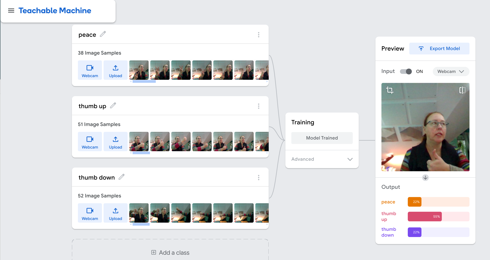
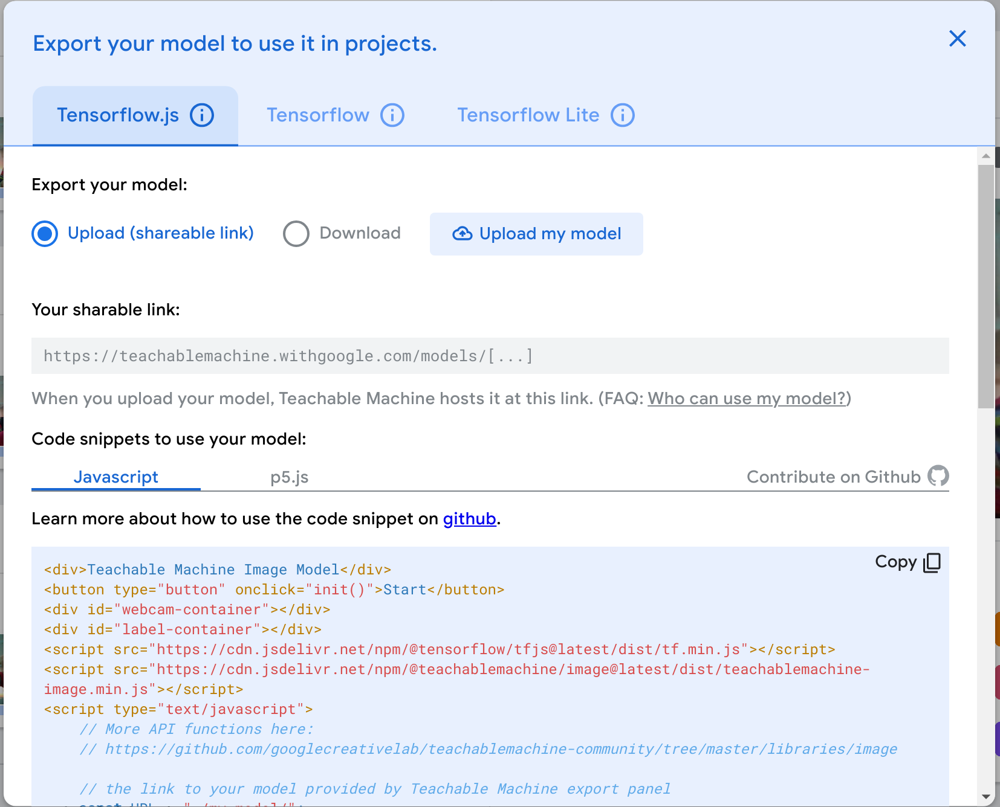
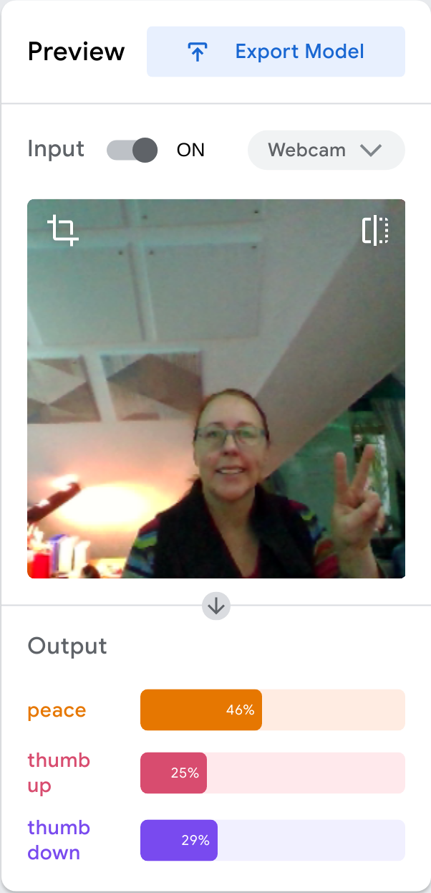

## GemCity ML: No /Low Code ML Tutorial
### Dec 30, 2023
### Evelyn J. Boettcher

Evelyn J. Boettcher's tutorial based on a Google Women Techmakers educational tutorial on how to make an image classifier application with No/Low Code.

This tutorial is designed to encourage kids to go into Computer Science by gently introducing them to AI and Machine learning. No Coding or ML experience needed.

Please bring a laptop. The goal of this tutorial is to walk you through the ML/AI concepts and build your own application that can recognize hand gestures, cat etc from a web camera.

This is a step-by-step guide to build an ML image application 

| Subject | Image                             |
|:----    |:----------------------------------|
| Train a model |  |
| Export Model |       |
| Integrate Model |       |

### In this Repo

* [Lesson Plan](./docs/lessonplan.pdf)
* [Slide Deck](./docs/slide_deck.html)
* [Web Application](./docs/application_demo/index.html)
* [Student Low Code Web Application](./docs/application_demo/)

